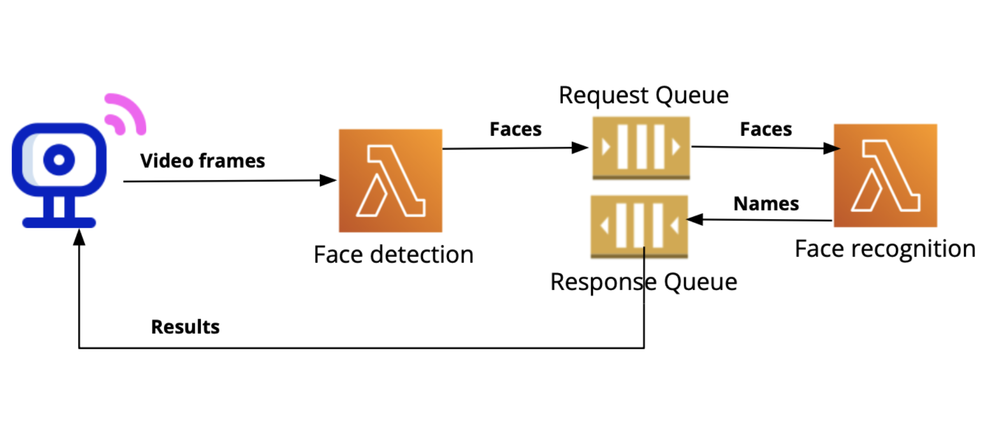

# Serverless Face Recognition Pipeline (AWS Lambda + ECR)

## 📌 Overview
This project implements a **serverless face recognition pipeline** using **AWS Lambda**, **Docker**, and **Elastic Container Registry (ECR)**. The system provides **Face Recognition as a Service** by processing video frames uploaded from client devices (e.g., IoT smart cameras).  

The pipeline is designed to be scalable, low-latency, and asynchronous using **Amazon SQS queues** for message passing between Lambda functions. It consists of two core stages:  

1. **Face Detection Lambda Function**  
   - Accepts video frames from clients via a function URL.  
   - Detects faces using the **MTCNN** deep learning model.  
   - Sends cropped face images to the **Request SQS Queue**.  

2. **Face Recognition Lambda Function**  
   - Triggered when a message arrives in the Request Queue.  
   - Performs recognition using a **ResNet (InceptionResnetV1, pretrained on VGGFace2)** model.  
   - Returns recognized names by sending results to the **Response SQS Queue**.  

This architecture ensures **scalability, concurrency, and loose coupling** between components, enabling the system to handle multiple client requests simultaneously with <2s average latency on 100 requests.

---

## 🏗️ Architecture

### 🔹 Components
- **AWS Lambda**  
  - `face-detection` function: extracts faces from frames.  
  - `face-recognition` function: identifies individuals using embeddings.  
- **Amazon ECR**  
  - Stores Docker images with packaged dependencies (PyTorch, facenet-pytorch, boto3, OpenCV, Pillow).  
- **Amazon SQS**  
  - **Request Queue**: transfers detected faces from `face-detection` to `face-recognition`.  
  - **Response Queue**: returns recognition results back to the client.  
- **Client (IoT/HTTP Server)**  
  - Sends frames via Lambda Function URL.  
  - Polls Response Queue for recognition results.  

### 🔹 Workflow
1. **Client Upload**  
   - Client sends a video frame (Base64-encoded) via HTTP POST to the **face-detection Lambda**.  

2. **Face Detection**  
   - Lambda extracts faces using **MTCNN**.  
   - Detected faces + request metadata are pushed to the **Request SQS Queue**.  

3. **Face Recognition**  
   - Triggered by the Request Queue.  
   - Embeddings are generated using **InceptionResnetV1**.  
   - Matches embeddings against stored dataset and returns classification results.  
   - Sends results to the **Response SQS Queue**.  

4. **Client Receives Results**  
   - Client polls the Response Queue for results.  
   - Each message contains `{ "request_id": <id>, "result": <classification result> }`.  

---

